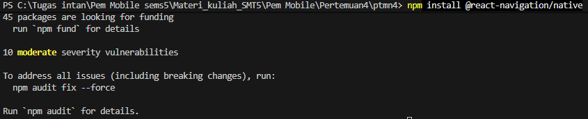
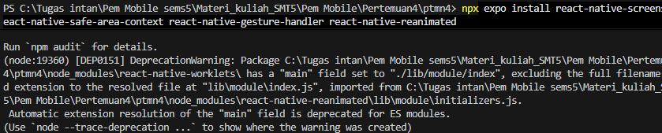
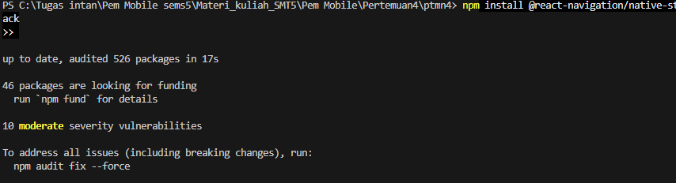
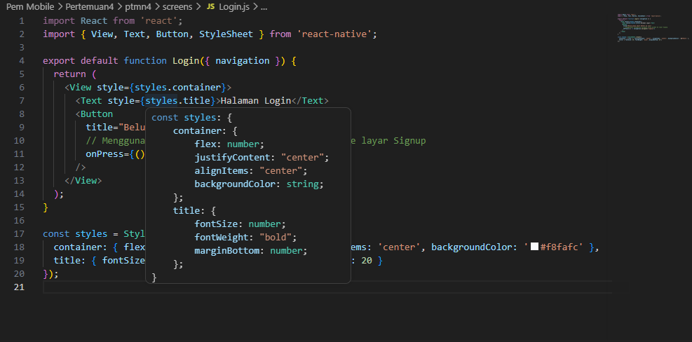
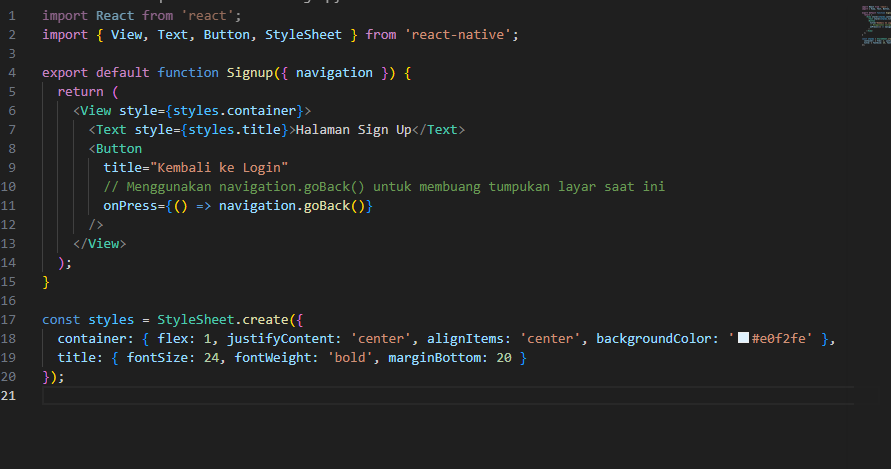
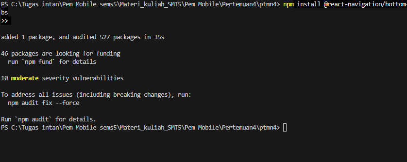
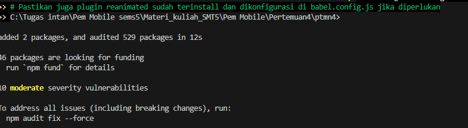
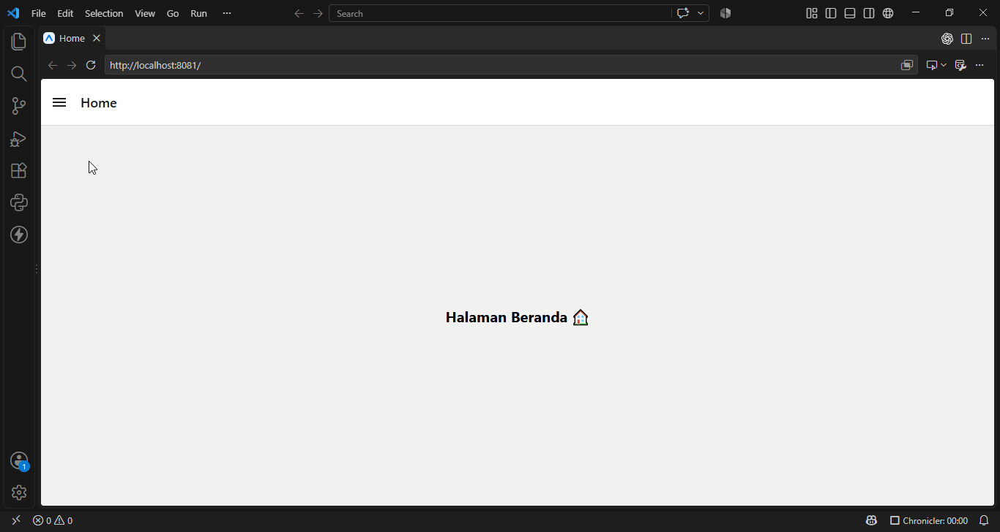

# Laporan praktikum 4 : navigation in react native

Langkah 1 : menginstall depedensi dan library yang dibutuhkan untuk membuat navigasi
1. install npm install @react-navigation/native

2. Install depending pendukung

Langkah 2. : membuat stack navigasi
1. install library stack

2. membuat folder screen yang terdapat login dan signup di dalamnya
3. bukti  login

4. bukti sign up

bukti stack navi

 

D. Bottom Tab Navigation
1. install library bottom tabs
2. bukti 

3. membuat file homescreen dan profilescreen
4. mengubah konfig app js

E. Drawer Navigation
1. install library drawer
2. 
3. bukti

