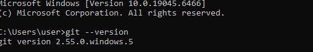
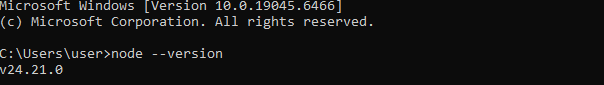
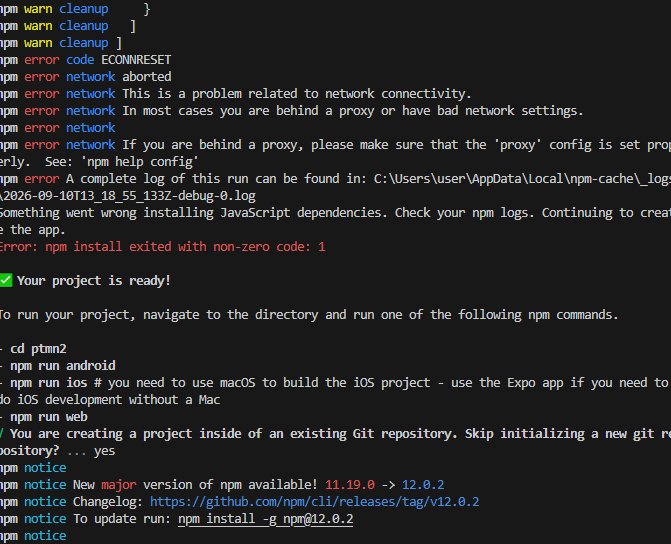
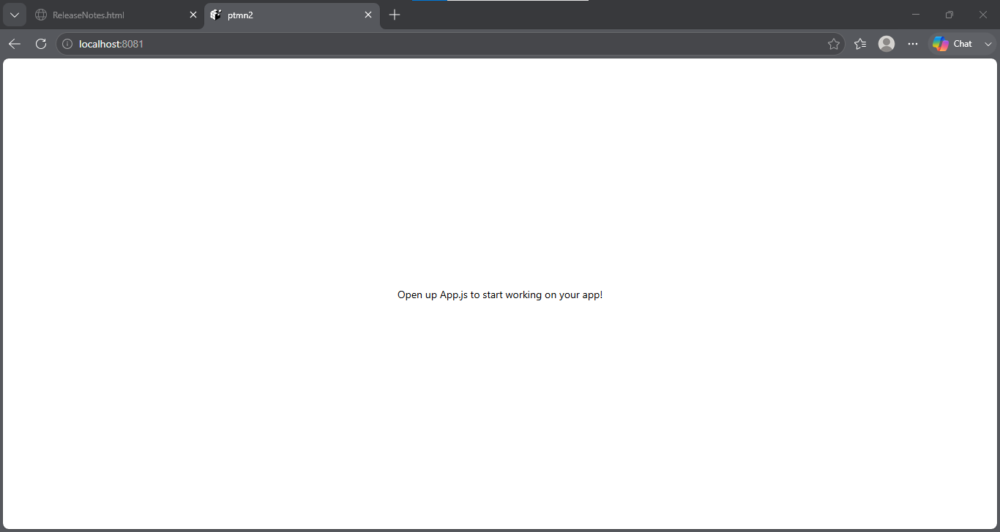
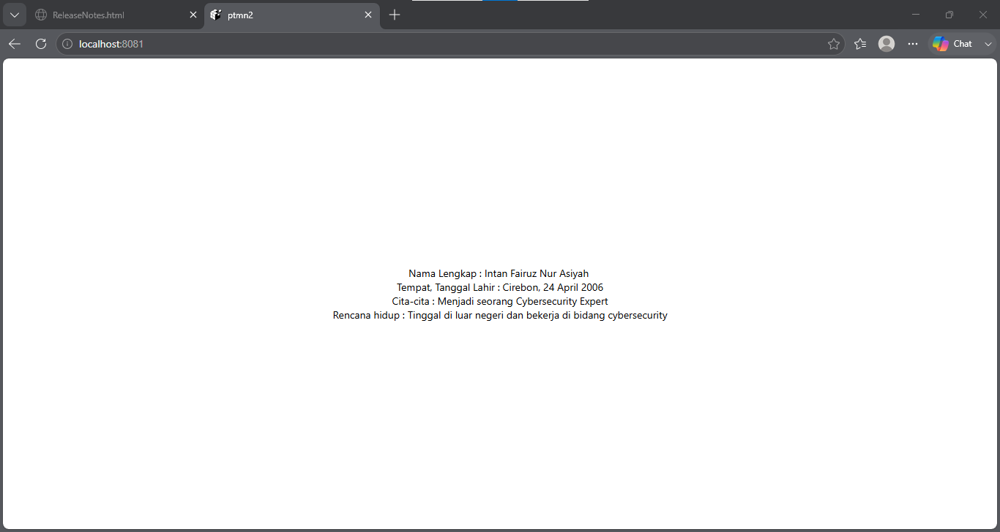

# **Praktikum Menyiapkan Memulai Pemrograman Mobile dengan React Native**
## **Tujuan Pembelajaran**
Setelah menyelesaikan modul praktikum ini, mahasiswa diharapkan mampu:
- Menginstal Git dan GitHub
- Menginstal Node.js dan NPM
- Menginstal Expo CLI
- Menginstal project React Native
- Menjalankan project React Native 

1. Install Git di local 
   - unduh dan instal Git Via https://git-scm.com/install/windows
   - Verifikasi Git (buka cmd dan ketik "git --version")
   

2. Install Node JS
   - Unduh dan Install Node JS via https://nodejs.org/en/download/
   - Verifikasi Node JS (buka cmd dan ketik "node --version" "npm --version")
   

3. Memulai Projek dengan Framework Expor
   - Buka terminal pada code editor
   - Pastikan aktif di directory yang dituju
   - Ketikan (npx create-expo-app ptmn2 --template blank)
   

4. Menjalankan Projek React Native 
  - Masuk ke directory projek (cd ptmn2)
  - Jalankan projek (npx expo start)
  - Scan QR Code dengan Aplikasi Expo Go
  - Jika ingin run emulator di WEB ketik w
  - di terminal "npx expo install react-dom react-native-web"
  - npx expo start --web
  
  
  5. LATIHAN PERTEMUAN-2
  - Tambahan text berupa
  - Nama Lengkap
  - Tempat Tanggal Lahir
  - Cita-cita
  - Rencana Hidup
  